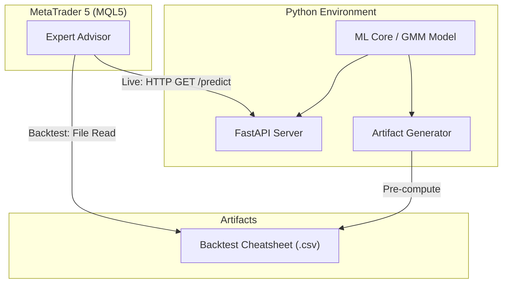
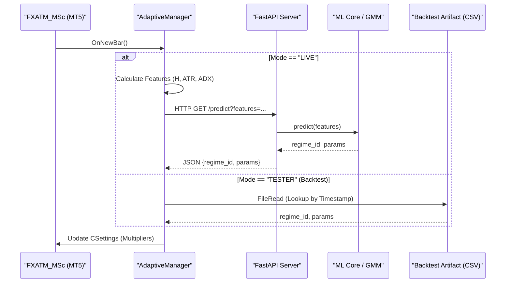

# Thesis Update Guide: FastAPI & Backtest Artifacts

> [!NOTE]
> This guide outlines the updates required for `0_DOCS/MSc_Thesis.md`.
> **Scope**: Changes are restricted to **Chapter 4 (Implementation)** and subsequent chapters. Chapters 1-3 remain unchanged.

## 1. Architectural Implementation Updates (Chapter 4)

### Section 4.1.1: System Architecture

**Architectural Diagram**:

**Current**: Mentions "three-layer design with MQL5... Python ML...".
**Update**: Modify the description to explicitly specify the **FastAPI** implementation.
**Suggested Text**:
> The implemented system follows a layered architecture...
> **Implementation Note**: While traditional architectures often utilize raw sockets (ZeroMQ), this implementation leverages **FastAPI**, a modern, high-performance web framework. This design choice exposes the Python ML Core as a robust **REST API**, improving interoperability and allowing the MQL5 client to utilize standard `WebRequest` protocols.

### Section 4.1.2: Component Implementation Details
**D. Inference Server (inference_server.py)**
**Update**: Rewrite this subsection to describe the FastAPI server and add the sequence diagram.
**Suggested Text**:
> **D. Inference Server (inference_server.py)**
> The real-time prediction engine is implemented as an asynchronous **FastAPI** application.
> * **API Endpoint**: `GET /predict`
> * **Protocol**: HTTP/1.1 (REST)
> * **Response Format**: JSON
>
> This replaces the complexity of maintaining low-level socket connections with a stateless, scalable HTTP service. The server utilizes `uvicorn` as the ASGI gateway, ensuring low-latency request handling suitable for the M15 trading timeframe.

**Updated Implementation Flow**:


---

## 2. New Component: Backtest Artifacts (Chapter 4)

### Section 4.1.2 (Add New Item E)
**Update**: Introduce the "Backtest Artifact Generator" here as a specific implementation component used for validation.
**Suggested Text**:
> **E. Backtest Artifact Generator (Backtest Cheatsheet)**
> To ensure deterministic and high-speed validation within the MetaTrader 5 Strategy Tester, a pre-computation utility was developed.
> * **Concept**: Instead of making thousands of network calls during a backtest (which is often restricted in the Strategy Tester), the system pre-calculates the regime and parameters for the entire simulation period.
> * **Output**: A CSV artifact (`backtest_cheatsheet.csv`) containing the `Timestamp`, `Regime_ID`, and optimal `Parameters`.
> * **Mechanism**: The EA checks its operating mode; if in `TESTER` mode, it bypasses the API and reads from this artifact, ensuring zero-latency, reproducible simulations.

---

## 3. Results & Validation Updates (Chapter 4)

### Section 4.3.3: Adaptive Backtest (ML-Driven Parameters)
**Update**: Update the "Configuration" list to reflect the artifact usage.
**Suggested Text**:
> **Configuration**:
> * EA: FXATM_MSc.mq5 (Adaptive)
> * **Data Source**: **Offline Backtest Artifact** (CSV Lookup) – *Selected for reproducibility and simulation speed.*
> * Period: 2021-2024
> ...

---

## 4. Discussion & Conclusion Updates (Chapter 5)

### Section 5.1.2: Practical Implications
**Update**: Briefly mention the advantage of the API approach (scalability) vs ZMQ.
**Suggested Text**:
> The transition from a ZeroMQ-based socket architecture to a **FastAPI REST API** significantly enhances the system's practical scalability and deployment flexibility. While ZeroMQ offers high performance for low-latency IPC, it introduces complexity in connection management and firewall configuration in distributed environments. Conversely, the RESTful approach leverages standard HTTP/1.1 protocols, making the inference server natively compatible with cloud-native infrastructure, load balancers, and standard web security practices. This shift ensures that the ML-driven trading engine can be easily decoupled from the execution terminal, allowing for centralized model management across multiple MT5 instances without the overhead of maintaining persistent, low-level socket state.

### Section 5.2.2: Practical Contributions
**Update**: Add a point about the "Modernized Architecture".
**Suggested Text**:
> * **Modernized REST Architecture**: Demonstrating the viability of using standard web protocols (FastAPI) for algorithmic trading, moving away from legacy socket implementations and enabling cloud-native deployment patterns.

### Section 4.5: System Monitoring & Dashboard (New Section)
**Update**: Suggest adding a brief section to showcase the Streamlit interface.
**Suggested Text**:
> To provide real-time visibility into the training process and model health, a **Streamlit-based Monitoring Dashboard** was implemented. This interface (shown in Figure 4.X) visualizes the Gaussian Mixture Model (GMM) cluster distribution, feature importance, and rolling Walk-Forward Analysis (WFA) results. It serves as the primary administrative layer for the MLOps pipeline, enabling visual verification of regime persistence and generalization stability.

**How to Insert into MSc_Thesis.md**:
1. **Best Location**: Chapter 4, immediately after **Section 4.1.2** (Component Implementation) as a new summary of the UI, or within **Section 4.4** (System Validation Summary) to provide visual evidence of the metrics.
2. **Markdown Syntax**:
   ```markdown
   
   *Figure 4.X: Monitoring dashboard displaying GMM cluster centroids and WFA efficiency metrics.*
   ```

> [!TIP]
> **Recommended Screenshot**: Capture the "Model Training" tab showing the Cluster Centroids table and the "WFA Results" tab showing the rolling Sharpe Ratio graph. This provides the strongest academic proof of your system's stability.
